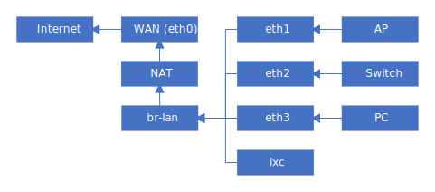

## 结构



## 接口配置

- **Tips:**
    - `*.link`、`*.netdev` 配置需要重启生效
    - 对于未配置的接口，使用 `sudo networkctl reload` 进行配置
    - 对于已配置的接口，使用 `sudo networkctl reconfigure <name>` 进行重新配置
    - 建议:
        - `*.link` 使用 `00-` 前缀
        - `*.netdev` 使用 `10-` 前缀
        - `*.network` 使用 `20-` 前缀
        - 具体视情况而定

### [选] 接口改名及修改 MAC

- 例: 将 MAC 为 `00:15:5d:01:78:01` 的接口改名为 `enp1` 并将 MAC 修改为 `00:15:5d:01:00:01`
- 创建并编辑 `/etc/systemd/network/00-enp1.link`

```ini
[Match]
MACAddress=00:15:5d:01:78:01

[Link]
Name=enp1
MACAddress=00:15:5d:01:00:01
```

### WAN 口启用 DHCP 获取 IP

- 无论是 `动态IP` 上网，亦或者是 `PPPoE拨号`，都建议开启 DHCP，**以便于访问光猫或上游设备**
- 以 `eth0` 为例
- 创建并编辑 `/etc/systemd/network/20-eth0.network`

```ini
[Match]
Name=eth0

[Network]
DHCP=yes
```

### 创建 br-lan 网桥

#### 创建网桥设备

- 创建并编辑 `/etc/systemd/network/10-br-lan.netdev`
- `MACAddress` 为可选项

```ini
[NetDev]
Name=br-lan
Kind=bridge
MACAddress=00:e2:69:75:f0:06
```

#### 设置 LAN 侧 IP

- 创建并编辑 `/etc/systemd/network/20-br-lan.network`

```ini
[Match]
Name=br-lan

[Link]
RequiredForOnline=no
ActivationPolicy=always-up
ARP=yes

[Network]
Address=192.168.64.1/24
ConfigureWithoutCarrier=yes
```

- DHCP Server (若使用 networkd 内置 DHCP 服务器，将下面内容追加到上面的配置文件中)

```ini
[Network]
DHCPServer=yes

[DHCPServer]
PoolSize=253
DNS=_server_address
BindToInterface=yes

# MACAddress 静态绑定
[DHCPServerStaticLease]
MACAddress = xx:xx:xx:xx:xx:xx
Address = xx.xx.xx.xx

[DHCPServerStaticLease]
MACAddress = xx:xx:xx:xx:xx:xx
Address = xx.xx.xx.xx
```

#### 将物理网口绑定到网桥

- 创建并编辑 `/etc/systemd/network/20-br-lan-bind.network`

```ini
[Match]
Name=eth1
Name=eth2
Name=eth3

[Network]
Bridge=br-lan
```

**至此，可将 `/etc/systemd/network/01-dhcp.network` 安全的删除**

## PPPoE 拨号

- 安装 ppp

```bash
# Debian
sudo apt install -y ppp
# Arch Linux
sudo pacman -Sy ppp
```


**LXC容器中使用ppp设备**

`sudo lxc-device add -n <name> /dev/ppp /dev/ppp`


### 创建拨号配置

- 以中国电信为例
- 创建并编辑 `/etc/ppp/peers/telecom`

```ini
plugin pppoe.so
eth0

# Username, Password
name "xxxxxxxxxxx"
password "xxxxxx"

noauth
pap-timeout 10
hide-password
ifname ppp-telecom

# Default Route
defaultroute
replacedefaultroute
ipv6cp-accept-local

# Detect Link Status
lcp-echo-interval 5
lcp-echo-failure 3
```

### 自动拨号

#### 对于 Arch Linux

- 创建并编辑 `/etc/systemd/system/ppp@.service.d/override.conf`

```ini
[Unit]
After=systemd-networkd.service

[Service]
Restart=always
RestartSec=30
StartLimitInterval=0
```

- 随后使用 `systemctl` 启用 `ppp@telecom.service` 即可

#### 对于 Debian

- 创建并编辑 `/etc/systemd/system/ppp-telecom.service`

```ini
[Unit]
Description=PPP link to Telecom
Before=network.target
After=systemd-networkd.service

[Service]
ExecStart=/usr/sbin/pppd call telecom nodetach nolog
Restart=always
RestartSec=30
StartLimitInterval=0

[Install]
WantedBy=multi-user.target
```

- 随后使用 `systemctl` 启用 `ppp-telecom.service` 即可

### IPv6 配置

#### PPPoE 接口 networkd 配置

```ini
# /etc/systemd/network/20-ppp-telecom.network
[Match]
Name=ppp-telecom

[Network]
# Keep ipcp IPv4
KeepConfiguration=static
# DHCPv6-PD Client
DHCP=ipv6
IPv6AcceptRA=no
DHCPPrefixDelegation=yes
# Default Route
DefaultRouteOnDevice=yes

[DHCPPrefixDelegation]
UplinkInterface=:self
#SubnetId=0x0
Announce=no
```

#### br-lan 下发 IPv6

**省略上文已配置内容**

```ini
# /etc/systemd/network/20-br-lan.network
[Match]
Name=br-lan

[Network]
DHCPPrefixDelegation=yes
IPv6SendRA=yes

[IPv6SendRA]
DNS=_link_local

[DHCPPrefixDelegation]
UplinkInterface=:auto
Announce=yes
```
