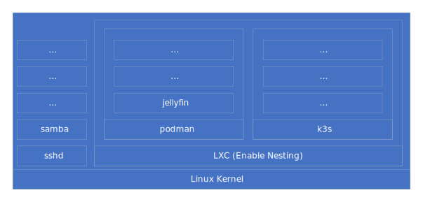
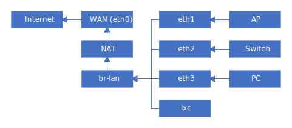


**当前阶段:**

VM 验证成功



**此文章仅适用于支持 UEFI 启动的计算机**


## 概述

### 目标

使用 Debian, 打造一个高度可自定义，完全可控的 **路由**、**NAS**、**计算** 一体机。为了极致的压榨设备性能，方案将杜绝 PVE、ESXi 等虚拟化方案，采用原汁原味的 Linux 生态，必要时采用容器化进行隔离。

### 起源

- 没有钱，不足以支撑我买多台设备，所以来玩 All in One
- 成品路由的功能太少，还不好自定义
- OpenWRT 的拨号在部分环境下会失败(eg: 校园网)

## 架构

### 系统架构

- 宿主机使用 Debian Testing 系统
    - Arch Linux 更新过于频繁
    - Debian sid 和 Arch Linux 滚的频率差不多
    - Debian Stable 的软件太老，存在配置兼容问题
- 与网关核心功能相关的服务直接运行在 Debian 上
- 其他服务运行在 podman 或 k3s 上
    - 由于 podman/k3s 会修改防火墙设置，使用 LXC 进行隔离
    - **为了极致压榨设备性能，此方案将杜绝一切虚拟化，将采用容器化方案**



### 网络架构

- 通过 eth0 接口，使用 PPPoE/DHCP 协议获取IP
- 使用 nftables 实现 NAT
- 创建 br-lan 网桥供 LAN 侧使用
- eth1/2/3 绑定至 br-lan
- LXC 容器也通过 br-lan 上网



### 存储方面

- 系统/数据隔离
- 系统采用 xfs
- 数据采用 zfs，开启压缩与数据去重

## 安装系统

### 进入 Arch Linux LiveCD

1. 从下列链接中任选一个，下载 `archlinux-xxxx.xx.xx-x86_64.iso`，烧录至U盘
    - <https://mirrors.bfsu.edu.cn/archlinux/iso/latest/>
    - <https://mirrors.nju.edu.cn/archlinux/iso/latest/>
    - <http://mirrors.ustc.edu.cn/archlinux/iso/latest/>
2. 将U盘插入目标计算机，启动U盘内的 LiveCD

- **注意：需要关闭主板的安全启动**

### 安装前的准备工作

#### 远程安装

- Arch Linux 的 LiveCD 默认开启 sshd 服务，可远程 ssh 登录后进行安装 (方便复制粘贴指令)

1. 使用 `passwd` 设置 root 用户密码
2. 使用 `ip addr` 查看本机 IP 地址
3. 在其他计算机通过 `ssh root@<IP>` 登录

#### 设置镜像及安装 debootstrap

1. 设置镜像

    ```bash
    echo 'Server = https://mirrors.bfsu.edu.cn/archlinux/$repo/os/$arch' | \
    tee /etc/pacman.d/mirrorlist
    ```

1. 安装 debootstrap

    ```bash
    sudo pacman -Sy debootstrap
    ```

### 对磁盘分区

- 分区表要求: GPT
- 引导分区要求:
    - 格式: vfat
    - 大小: 128MB+
- 系统分区要求:
    - 格式: ext4 或 xfs 或 btrfs
    - 大小: 4GB+


**若磁盘无数据可按照下列操作方式进行分区:**

- 假设磁盘为 `/dev/sda` (可用 `fdisk -l` 查看)

1. 使用 fdisk 打开磁盘: `fdisk /dev/sda`
1. 创建新 GUID 分区表: `g`
1. 创建引导分区: `n` -> `1` -> `留空` -> `+256M`
1. 更改分区类型: `t` -> `1`
1. 创建系统分区: `n` -> `2` -> `留空` -> `留空`
1. 保存并退出: `w`

格式化:

- `mkfs.vfat /dev/sda1`
- `mkfs.xfs /dev/sda2`



### 挂载分区

- 将磁盘路径写入环境变量，节省输入量

```bash
export ESP="/dev/sda1"
export ROOTFS="/dev/sda2"
```

- 挂载

```bash
mount $ROOTFS /mnt
mkdir -p /mnt/boot/efi
mount $ESP /mnt/boot/efi
```

### 使用 debootstrap 安装系统

```bash
# debootstrap --arch <ARCH> <BRANCH> <ROOTFS> <REPO_URL>
# ARCH: i386 amd64 arm64 armel armhf mipsel mips64el pcc64el s390x
# BRANCH: experimental sid testing stable buster bullseye bookworm

debootstrap --arch amd64 testing /mnt https://mirrors.bfsu.edu.cn/debian
```

### 生成 fstab

```bash
genfstab -U /mnt >> /mnt/etc/fstab
```

## 配置系统

### chroot 进入系统

```bash
arch-chroot /mnt
```

### 设置 Debian 镜像源

```bash
export MIRROR_URL="http://mirrors.bfsu.edu.cn"
export BRANCH="testing"
export COMPONENT="main contrib non-free non-free-firmware"

echo "deb ${MIRROR_URL}/debian/ ${BRANCH} ${COMPONENT}
deb ${MIRROR_URL}/debian/ ${BRANCH}-updates ${COMPONENT}
deb ${MIRROR_URL}/debian-security/ ${BRANCH}-security ${COMPONENT}" | \
tee /etc/apt/sources.list && apt update && apt install ca-certificates

export MIRROR_URL="https://mirrors.bfsu.edu.cn"

echo "deb ${MIRROR_URL}/debian/ ${BRANCH} ${COMPONENT}
deb ${MIRROR_URL}/debian/ ${BRANCH}-updates ${COMPONENT}
deb ${MIRROR_URL}/debian-security/ ${BRANCH}-security ${COMPONENT}" | \
tee /etc/apt/sources.list && apt update
```

### 安装必要软件包

```bash
apt install -y efibootmgr sudo locales xfsprogs
```

### 设置主机名

```bash
export HOST_NAME="router"

echo "${HOST_NAME}" | tee /etc/hostname
echo "127.0.0.1   localhost
::1         localhost
127.0.0.1   ${HOST_NAME}" | tee /etc/hosts
```

### 设置时区和语言

```bash
ln -sf /usr/share/zoneinfo/Asia/Shanghai /etc/localtime

sed -i 's/# en_US.UTF-8 UTF-8/en_US.UTF-8 UTF-8/g' /etc/locale.gen
sed -i 's/# zh_CN.UTF-8 UTF-8/zh_CN.UTF-8 UTF-8/g' /etc/locale.gen

/usr/sbin/locale-gen
echo 'LANG="zh_CN.UTF-8"' | tee /etc/locale.conf
```

### 添加用户

```bash
export NEW_USER="admin"

/usr/sbin/useradd -m -U -G sudo ${NEW_USER}
passwd ${NEW_USER}
```

### 安装内核及引导

- 安装内核

```bash
apt install -y linux-image-generic
```

- 创建 post-update 脚本 **(看不懂没关系 复制、粘贴、 执行 就行了)**

```bash
mkdir -p /boot/efi/EFI/Debian/

echo '#!/bin/sh
cp /vmlinuz /boot/efi/EFI/Debian/' | \
tee /etc/kernel/postinst.d/zz-update-efistub | \
tee /etc/kernel/postrm.d/zz-update-efistub

chmod +x /etc/kernel/postinst.d/zz-update-efistub
chmod +x /etc/kernel/postrm.d/zz-update-efistub
/etc/kernel/postinst.d/zz-update-efistub

mkdir -p /etc/initramfs/post-update.d
echo '#!/bin/sh
cp /initrd.img /boot/efi/EFI/Debian/' | \
tee /etc/initramfs/post-update.d/zz-update-efistub

chmod +x /etc/initramfs/post-update.d/zz-update-efistub
/etc/initramfs/post-update.d/zz-update-efistub
```

- 添加 EFIStub 启动项

```bash
export UUID=$(/usr/sbin/blkid -s UUID -o value $ROOTFS)
efibootmgr -c -g -L "Debian" -l '\EFI\Debian\vmlinuz' \
  -u "root=UUID=$UUID rw loglevel=3 rootfstype=xfs add_efi_memmap initrd=\\EFI\\Debian\\initrd.img"
```

### [选] 开启 DHCP 客户端和 SSH 服务

- 启用 DHCP 获取 IP
    - **通用配置，临时使用，后续配置网络时会删除**
    1. 编辑 `/etc/systemd/network/01-dhcp.network`
    1. 填写以下内容
        ```ini
        [Match]
        Name = e*

        [Network]
        DHCP = yes
        ```
        - 一键脚本
        ```bash
        echo "[Match]
        Name = e*

        [Network]
        DHCP = yes" | tee /etc/systemd/network/01-dhcp.network
        ```
    1. 设置开机自启
        ```bash
        systemctl enable systemd-networkd
        ```
- 启用 SSH 服务器
    - 对于 Debian，**安装默认自启**
        ```bash
        apt install -y openssh-server
        ```

## 退出并重启

```bash
exit
reboot
```
