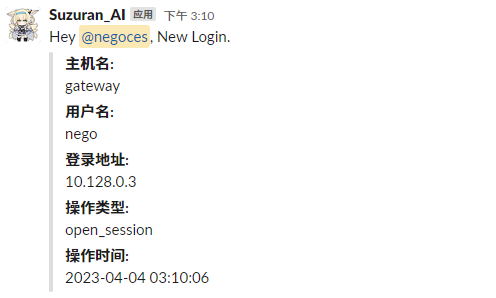

## 预览



## 部署

### 源码 (Golang)

**替换 `line 12-14` 的内容**

- token: 前往 <https://api.slack.com/apps> 创建 App, 在 **Settings** -> **Installed App** 中获取
- channel_id: 在频道详细信息的最下方获取
- user_id: 在用户档案里的 **复制成员 ID** 获取

```go
package main

import (
	"os"
	"time"

	"github.com/slack-go/slack"
)

func main() {
	hostname, _ := os.Hostname()
	var bot_token string = "token"
	var channel_id string = "频道名/频道ID"
	var user_id string = "用户ID"
	var msg_content string = "Hey <@" + user_id + ">, New Login."
	var attachment slack.Attachment = slack.Attachment{
		Fields: []slack.AttachmentField{
			{
				Title: "主机名:",
				Value: hostname,
			}, {
				Title: "用户名:",
				Value: os.Getenv("PAM_USER"),
			}, {
				Title: "登录地址:",
				Value: os.Getenv("PAM_RHOST"),
			}, {
				Title: "操作类型:",
				Value: os.Getenv("PAM_TYPE"),
			}, {
				Title: "操作时间:",
				Value: time.Now().Format("2006-01-02 03:04:05"),
			},
		},
	}
	api := slack.New(bot_token)
	api.PostMessage(channel_id, slack.MsgOptionText(msg_content, false), slack.MsgOptionAttachments(attachment))
}
```

### 编译

```bash
go build -ldflags "-s -w"
```

**编译完成后移动到你喜欢的路径，文章以 `/opt/bin/watchdog` 为例**

## Hook

编辑 `/etc/pam.d/sshd`, 追加：

```ini
session   optional  pam_exec.so seteuid /opt/bin/watchdog
```

**完事!**
